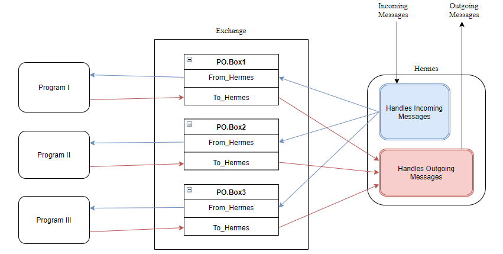

# Hermes
A message bot worthy of the gods!


This bot makes use of the Telegram API, it is however designed to work a bit unconventionally... 

## How It Works

The idea behind this bot was not to make a bot with a template reply. But rather one that that can interact with your programs, whatever they might be. This is done through means of an *Exchange*. When a message is sent through. Hermes will determine which PO.Box in the exchange it should go to. It will then take the message to the *"From_Hermes"* folder in the PO.Box. The idea is that whatever program you are interacting with, will monitor the *"From_Hermes"* folder. Once a message comes through the program will execute the command and return to output to the *"To_Hermes"* folder, at which point Hermes will take the output and use it as the response to the original message sent.

The Beauty of this setup is that Hermes can interact with any program written in any language, be it python, Java, C#, C++ or even. bat scripts. Below is a diagram illustrating how this process works.



## Try It Out

### Getting All The Files And Libraries

First things first, you'll need to get your Telegram API key. It's free and simple just speak to the BotFather... https://core.telegram.org/bots#6-botfather

The Hermes messenger bot makes use of the pyTelegramBorAPI library. Enoder for this program to work you'll need to install the required packages. The following link describes how to do this:   https://github.com/eternnoir/pyTelegramBotAPI

You can now proceed in pressing the big green button *"Clone or download"* located on the top right conner of the page and selecting *"Download ZIP"*. You'll now have all the file to run the program. Following this you'll just need to create your exchange and edit the config file.

### Creating The Exchange ###

The *Exchange* complex thou it might seem is just a set of folders inside each other.

You'll need on one main folder titled "Exchange". With in this folder you need to create a "POBox#" folder for each program. The '#' represents the program's number, i.e "POBox0", "POBox1", "POBox2"... Remember computers start counting at "0" so start with "POBox0".
Inside every POBox folder you'll need the last remaining two folders namely, From_Hermes and To_Hermes.
The "From_Hermes" folder will contain the original message sent through. Your program will then take this as input. The output of the program should then be placed in the To_Hermes folder. Hermes will then take this and send it through as the response to the original message.

You'll need to reference the path of the "From_Hermes" and "To_Hermes" folders in the config file. 

### Editing the Config File ###

You do not have to change any of the code you can use the executable file as is. The only thing you'll need to change is the config file and you'll need to create the exchange file directories and reference them accordingly in this file. Also insure there are no blank lines in the config file. The file should also be located in the same directory as the Hermes.exe file and have the title "HermesConfig.txt". There is no limit to the number of programs Hermes can interact with.

Here's an example of the config file layout:

```
Hermes_Bot_Token:
982gkjh28746u42hraodsmcnB87345gjhg7347
Hermes 2 Exchange:
C:\Users\zeus\Codes\Python\scr\Exchange\POBox0\From_Hermes
C:\Users\zeus\Codes\Python\scr\Exchange\POBox1\From_Hermes
C:\Users\zeus\Codes\Python\scr\Exchange\POBox2\From_Hermes
C:\Users\zeus\Codes\Python\scr\Exchange\POBox3\From_Hermes
Exchange 2 Hermes:
C:\Users\zeus\Codes\Python\scr\Exchange\POBox0\To_Hermes
C:\Users\zeus\Codes\Python\scr\Exchange\POBox1\To_Hermes
C:\Users\zeus\Codes\Python\scr\Exchange\POBox2\To_Hermes
C:\Users\zeus\Codes\Python\scr\Exchange\POBox3\To_Hermes
Hermes Chat History File:
C:\Users\zeus\Codes\Python\scr\HermesChatHistory.txt
End of Config
```

With the config file, you'll also need to create a chat history file called "HermesChatHistory.txt". This file should also be referenced in the config file.

### I'm Alive! ###

Once you are confident that you have edited the config file correctly and compiled the Exchange folder hierarchy accordingly, then you can run the executable and send the wake-up command:

Either of the following will do:

```
/start  
/wakeup 
/areyoualive 
/areyoualive?
```

If everything is set up correctly, you'll then receive the following:

```
I'm alive!
```

This will indicate everything is working as it should. You can now start sending your commands through.

__ALL MESSAGES SHOULD BE IN THE FOLLOWING FORMAT:__

First the exchange number followed by "#" and then your message.

```
0# Hello Venus
```
Hermes will then insure the message (without "0#") gets delivered to the right exchange. Once the message is delivered Hermes will wait to receive the response. __It must receive a response to continue.__ Once a response is received, Hermes will then sent it through to the user. After the response is sent through Hermes will go through all the response files from all the exchanges. To check if there are any additional information that might have come through.

The following example will send a famous quote from The Iliad written by Homer to exchange number 3 (Exchange/POBox3/From_Hermes).

```
3# "Let me not then die ingloriously and without a struggle, but let me first do some great thing that shall be told among men hereafter." -The Iliad- Chapter 22 -Homer-
```


### Compiling The .exe ###

If you are curious to see how the code looks feel free to have a look at the Hermes.pyw file. The code is written in such a way that no changes need to be made. You can use the Hermes.exe file as is. The only file that requires editing is the config file. 

If you do want to edit the code and run it as a .exe file, then there is a little trick you should know about. The more perceptive of you might have noticed that we are using a .pyw file instead of a .py. The reason for this, to quote the official documentation is as follows:

*"Python scripts (files with the extension .py) will be executed by python.exe by default. This executable opens a terminal, which stays open even if the program uses a GUI. If you do not want this to happen, use the extension .pyw which will cause the script to be executed by pythonw.exe by default (both executables are located in the top-level of your Python installation directory). This suppresses the terminal window on startup."* https://docs.python.org/2/using/windows.html

The reason we don't want to open the terminal, is somehow this lets the program run once and then it kills it. However, we want Hermes to run continually non-stop and for this we'll need the .pyw extension.

Now to make the .pyw file a .exe you'll need to install pyinstaller, learn how to do it over here:  https://www.pyinstaller.org/
When this is done you'll need to go to the directory via the command line and execute specifically the following command:

```powershell
pyinstaller -F --hidden-import "babel.numbers" Hermes.pyw
```
### The Achilles Heel ###

There two things that should be noted. These are the two big limitation of this code. The first being that when Hermes sends a message through, it expects a response. __Nothing will happen until it receives a response.__ Only after a response is received, will you be able to send the next message through.

The second thing that should be kept in mind is that Hermes only looks at the "To_Hermes" folder (folder containing response from the program) after a message is sent to the "From_Hermes" folder. What this means is a program that sends updated through periodically will not work. Those updates will only be received after a message is sent.

## Create Your Own Program To Work With Hermes ##

If you want to create your own program that works with Hermes you can follow these steps:

1. Remember your program will receive it's input from a .txt file located in the "From_Hermes" folder(Exchange/POBox#/From_Hemes). This is where Hermes placed the message that was sent.
2. Your program can now use this input to execute the appropriate task. Once done it should return it's output in a .txt file to the "To_Hermes" folder(Exchange/POBox#/To_Hemes). Hermes will then take the data inside this .txt file and use it as the response to the original message that was sent through.

Now to aid you in creating your program. I have included a cool python3 function which does all the heavy lifting for you. The same function is used in Hermes.

### hedwig_protocol() ###


The hedwig_protocol() function is a Python3 function, allowing you to either send files to a folder or to take files from a folder. The in-code comments will give you a more thorough explanation: 

```python3
import os
import time

def hedwig_protocol(listen_or_take, file_name, take_this):

    # THERE ARE TWO PARTS TO THIS FUNCTION:
    # -------------------------------------------------------------------------------------
    #
    # LISTEN:
    # This code is ment to be placed in a continues while loop.
    # If "listen" is selected the code will monitors a specific folder.
    # If there are text files inside, it will choose the oldest one and return the output.
    # Following this it will also remove the file.
    #
    # listen_or_take = "listen"
    # filename = The file path of the file you are monitoring.
    # take_this = ""
    #
    # -------------------------------------------------------------------------------------
    #
    # TAKE:
    # Code creates a file with text inside.
    #
    # listen_or_take = "take"
    # filename = The file path of the file you want to create.
    # take_this = The text you want to write to the file.
    #
    # -------------------------------------------------------------------------------------

    if listen_or_take == "listen":

        try:

            # Counts number of files in folder.
            file_count = sum([len(files) for r, d, files in os.walk(file_name)])

            if file_count > 0:
                # The following code is used to determine the oldest file in the folder.
                path = file_name
                os.chdir(path)
                files = sorted(os.listdir(os.getcwd()), key=os.path.getmtime)

                oldest_file = files[0]
                # newest_file = files[-1]

                # now do something with the oldes file....
                fr = open(oldest_file)
                text = fr.read()
                fr.close()

                os.remove(oldest_file)  # Removes oldest file.

                return text

        except:
            # When a file is being copied while the Hedwig_protocol is running
            # it can cause and error, a delay helps with this.
            time.sleep(1)

    elif listen_or_take == "take":

        # WRITE TO A FILE
        fw = open(file_name, 'w')
        fw.write(take_this)
        fw.close()

```

### PowerShellExecutor Test Program ###


I have attached a test program that you can try out. It will take each command that comes in to "From_Hermes" folder and execute it in PowerShell. It will then send the output to the "To_Hermes" folder, where Hermes will then take it as a response to the original message sent.

The files can be found in the PowerShellExecutor directory. You'll have to compile the executable using pyinstaller.
You can go to the PowerShellExecutor directory via the command line, once you've downloaded it. When you're in the directory you can use the following command to create the executable.

```powershell
pyinstaller .\PowerShellExecutor.pyw
```

This will then generate a number of new files. You'll find all the files you need within the * dist * directory. Just copy the PowerShellExecutorConfig.txt to this directory then you're good to go.

If you want both the Hermes and the PowerShellExecutor to start automatically when your pc boots up. Then just create a shortcut of both the Hermes.exe and the PowerShellExecutor.exe and place these in your startup folder. You can find your startup folder by bringing up the Run box and typing in `shell:common startup` and then hitting Enter.


